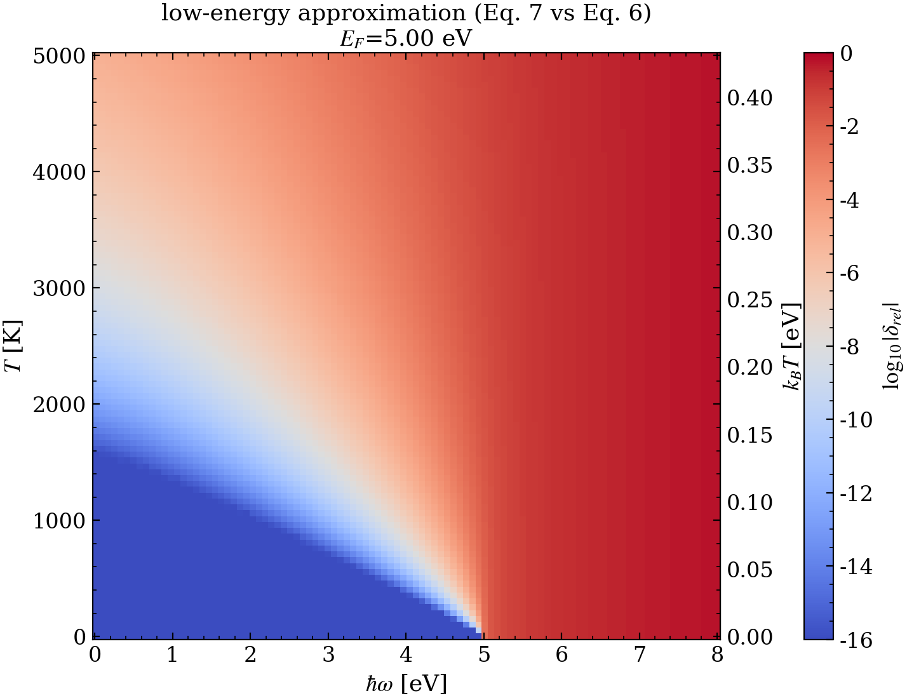

$$
\boxed{\begin{align}
I^{T}(\hbar\omega) = \; & \rho^{2}(\mathcal{E}_{F}) \frac{1}{e^{\beta\hbar\omega}-1}\left[\hbar\omega+ \frac{1}{\beta}\ln\left(1+e^{-\beta\mu}\right)-\frac{1}{\beta}\ln\left(1+e^{\beta(\hbar\omega-\mu)}\right)\right] \tag{6}\\ \\
I^{T}(\hbar\omega)\;=& \; \rho^{2}(\mathcal{E}_{F})\,\frac{\hbar\omega}{e^{\beta\hbar\omega}-1}\, \tag{7}
\end{align}}
$$

Eq. (6) is a closed-form expression for the constant-eDOS integral, and Eq. (7) is a low energy low temperature approximation. To assess how agreeable the two functions are we calculate their relative error as a function of emission energy $\hbar\omega$ and temperature $T$.
$$
\delta_{\mathrm{rel}}(\hbar\omega,T)
=\left|\frac{I_{(7)}(\hbar\omega,T)-I_{(6)}(\hbar\omega,T)}{I_{(6)}(\hbar\omega,T)}\right| \tag{8}
$$

where $I_{(6)}$ and $I_{(7)}$ denote expressions (6) and (7), respectively. Below is the plot of $(8)$ 

Figure 1.1: Heat map of $\log_{10}|\delta_{\mathrm{rel}}|$ for Eq. (7) relative to Eq. (6), evaluated at $\mathcal{E}_F=5\,\mathrm{eV}$. The vertical axis is plotted in $k_B T$ (with a secondary axis in $T$) to make the controlling dimensionless ratios explicit.

$$
\begin{align}
&\ln\left(1+e^{\beta(\hbar\omega-\mu)}\right)\approx 0 \\
&\iff {\beta(\hbar\omega-\mu)}\ll-M && M\in\mathbb{R}>0 \\
&\iff k_{\small B}T\ll \mu - \frac{1}{M}\hbar\omega
\end{align}
$$

## Results and discussion
If one is concerned with low electron temperatures and emission energies $\hbar\omega < \mathcal{E}_{F}$ the approximation. Still, it is not clear why on

- In the beginning I was calculating $\delta_{\text{rel}}$ with $(7)$ and $(8)$ explicitly. This created an issue for very small values of $\hbar\omega$ due to an unstable factor of ${n_{B}(\omega)/}{n_{B}(\omega)}$. This was immediately solved by simply cancelling the two terms.

In the remainder of the pipeline we will use Eq. (6) as the “exact” constant-eDOS reference. The next stage therefore establishes that the numerical evaluation of Eq. (5) converges to Eq. (6) for a practical (and not overly conservative) choice of integration step $\Delta\mathcal{E}$.
