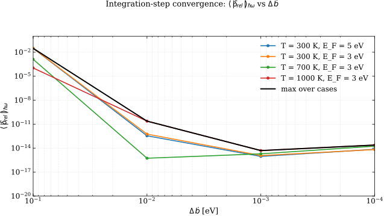
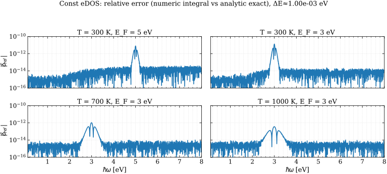

$$
\boxed{\begin{align}
&\rho^{2}(\mathcal{E}_{F})\int_{0}^{\infty}
f^{T}(\mathcal{E}+\hbar\omega)\big[1-f^{T}(\mathcal{E})\big]\,
\,
d\mathcal{E} \tag{5}\\ \\ 
\; &\rho^{2}(\mathcal{E}_{F}) \frac{k_BT}{e^{\beta\hbar\omega}-1}\Big[\beta\hbar\omega+\ln\left(1+e^{-\beta\mu}\right)-\ln\left(1+e^{\beta(\hbar\omega-\mu)}\right)\Big] \tag{6}
\end{align}}
$$

This comparison is between equivalent (rather than approximate) expressions and it serves as a good testing ground for numerical convergence as we expect to be able to reach near machine accuracy.

The purpose of this stage is therefore to (i) implement a numerically stable evaluation of Eq. (5), (ii) verify convergence with respect to the integration step $\Delta\mathcal{E}$ by comparison to Eq. (6), and (iii) select a practical step size for later stages.

## Figures

Figure 2.1: Convergence of the $\hbar\omega$-averaged error $\langle|\delta_{\mathrm{rel}}^{(2)}|\rangle_{\hbar\omega}$ versus the effective integration step $\Delta\mathcal{E}_{\mathrm{eff}}$ for several representative $(T,\mathcal{E}_F)$ cases. The black curve is the envelope (max over cases).

Figure 2.2: Pointwise error $\delta_{\mathrm{rel}}^{(2)}(\hbar\omega)$ evaluated on the default energy grid, for the same set of $(T,\mathcal{E}_F)$ cases used in the convergence scan.

## Numerical formulation

Eq. (5) is defined on $\mathcal{E}\in[0,\infty)$. Numerically we truncate to a finite interval $[\mathcal{E}_{\min},\mathcal{E}_{\max}]$ and discretize it by a uniform grid of step $\Delta\mathcal{E}$. For each emission energy $\hbar\omega$ we compute
$$
I_{\mathrm{num}}(\hbar\omega;T,\mathcal{E}_F)
=\rho_F^2\int_{\mathcal{E}_{\min}}^{\mathcal{E}_{\max}}
f^{T}(\mathcal{E}+\hbar\omega)\,[1-f^{T}(\mathcal{E})]\;d\mathcal{E}.
\tag{S2.1}
$$

## Log-stable thermal factor

The factor $f^{T}(\mathcal{E}+\hbar\omega)[1-f^{T}(\mathcal{E})]$ is evaluated in log form to avoid overflow/underflow. Let
$$
a=\beta(\mathcal{E}-\mu),\qquad b=a+\beta\hbar\omega.
$$
Then
$$
f^{T}(\mathcal{E}+\hbar\omega)\,[1-f^{T}(\mathcal{E})]
=\frac{e^{a}}{(1+e^{a})(1+e^{b})},
$$
and therefore
$$
\log\!\Big(f^{T}(\mathcal{E}+\hbar\omega)\,[1-f^{T}(\mathcal{E})]\Big)
=a-\log(1+e^{a})-\log(1+e^{b}).
\tag{S2.2}
$$
In code, $\log(1+e^x)$ is computed as $\mathrm{logaddexp}(0,x)$, and the exponentiation is performed once at the end.

## Quadrature and grid construction

The integral in (S2.1) is evaluated with composite Simpson’s rule on a uniform grid. For a requested maximum step $\Delta\mathcal{E}$ we choose an even number of intervals $N$ and set
$$
\mathcal{E}_{\text{grid}}=\mathrm{linspace}(\mathcal{E}_{\min},\mathcal{E}_{\max},N+1),
\qquad
\Delta\mathcal{E}_{\mathrm{eff}}=\frac{\mathcal{E}_{\max}-\mathcal{E}_{\min}}{N}\le \Delta\mathcal{E},
\tag{S2.3}
$$
so that Simpson’s rule applies directly and the actual step used in the convergence plot is $\Delta\mathcal{E}_{\mathrm{eff}}$.

## Reference evaluation of Eq. (6)

Eq. (6) is evaluated in a numerically stable form by defining $x=\beta\hbar\omega$ and writing
$$
I_{\mathrm{exact}}(\hbar\omega;T,\mathcal{E}_F)=\rho_F^2\,k_B T\,R(\hbar\omega),
$$
with
$$
R(\hbar\omega)=
\begin{cases}
\dfrac{x+\ln\!\left(1+e^{-\beta\mu}\right)-\ln\!\left(1+e^{\beta(\hbar\omega-\mu)}\right)}{e^{x}-1}, & x\neq 0,\\
\dfrac{1}{1+e^{-\beta\mu}}, & x=0.
\end{cases}
$$
The denominator $e^{x}-1$ is computed using $\mathrm{expm1}(x)$.

## Error metrics

The stage-2 pointwise relative error is
$$
\delta_{\mathrm{rel}}^{(2)}(\hbar\omega)
=\left|\frac{I_{\mathrm{num}}(\hbar\omega)-I_{\mathrm{exact}}(\hbar\omega)}{I_{\mathrm{exact}}(\hbar\omega)}\right|.
\tag{S2.4}
$$
For the convergence scan we summarize the error by averaging over a $\hbar\omega$ window $\mathcal{W}$,
$$
\left\langle |\delta_{\mathrm{rel}}^{(2)}| \right\rangle_{\hbar\omega}
=\frac{1}{N}\sum_{\hbar\omega\in\mathcal{W}} |\delta_{\mathrm{rel}}^{(2)}(\hbar\omega)|,
\tag{S2.5}
$$
while masking points where $|I_{\mathrm{exact}}|$ is extremely small, since relative error becomes ill-conditioned in the exponentially suppressed tail.

## Results and discussion

Figure 2.1 shows rapid reduction of the mean error with decreasing $\Delta\mathcal{E}$ until an accuracy floor is reached. This floor is not set by the quadrature order, but by conditioning and floating-point effects: refining the grid increases the number of samples in the composite rule, and beyond a point the remaining discretization error is comparable to accumulated roundoff.

Figure 2.2 highlights why “machine precision” is not a meaningful target for a relative error plotted over a wide $\hbar\omega$ range: at large $\hbar\omega$ the reference signal is exponentially small, so dividing by $I_{\mathrm{exact}}$ amplifies tiny absolute differences (including differences introduced by finite truncation and underflow far from the thermal peak).

With a numerically stable and demonstrably converged treatment of Eq. (5) in hand, we now turn to the *physics approximation* itself: replacing $\rho(\mathcal{E}+\hbar\omega)\rho(\mathcal{E})$ by $\rho^2(\mathcal{E}_F)$ in Eq. (4). This is the focus of Stage 3.

