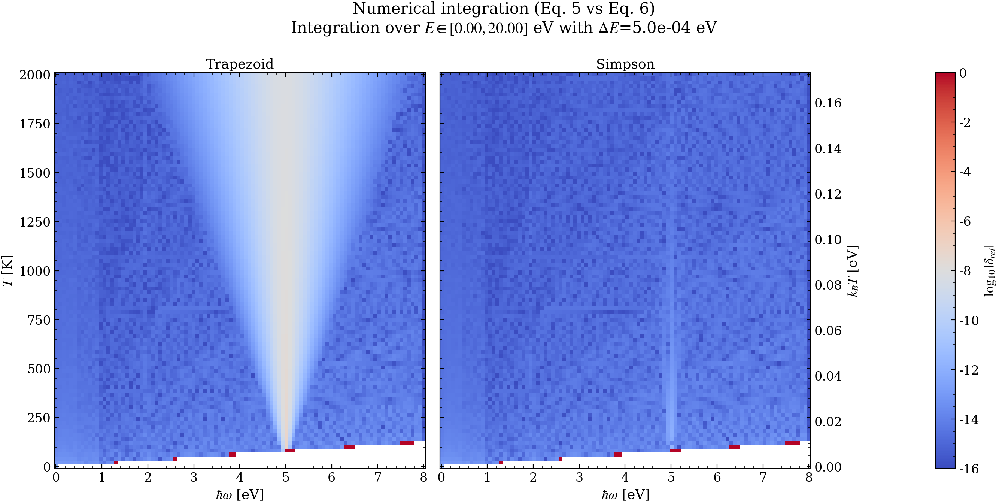
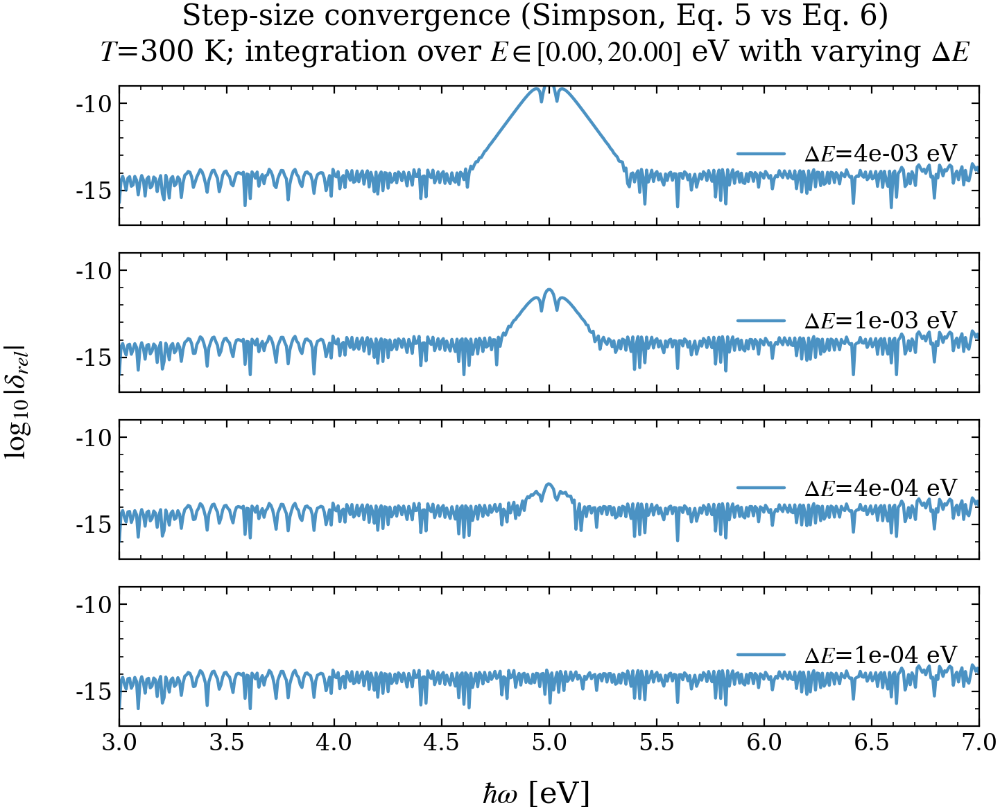
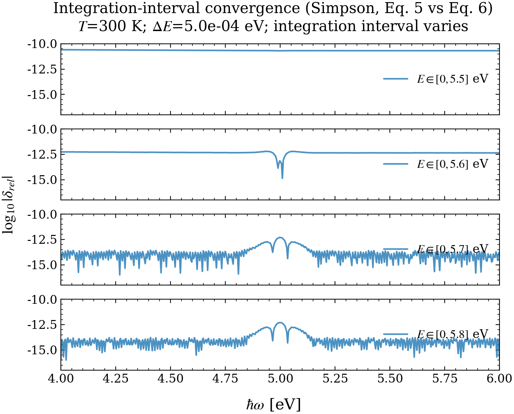
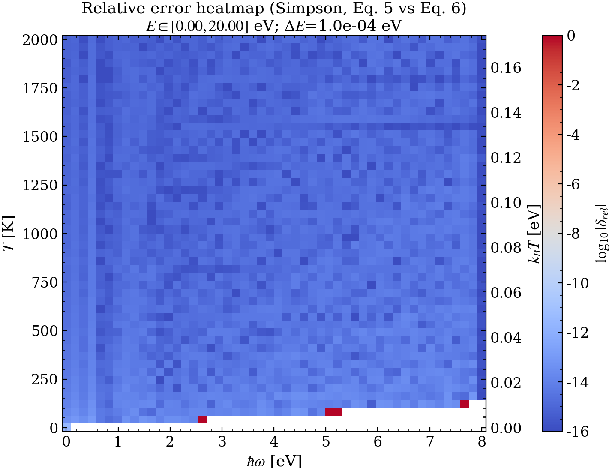

$$
\boxed{\begin{align}
&\rho^{2}(\mathcal{E}_{F})\int_{0}^{\infty}
f^{T}(\mathcal{E}+\hbar\omega)\big[1-f^{T}(\mathcal{E})\big]\,
\,
d\mathcal{E} \tag{5}\\ \\ 
\; &\rho^{2}(\mathcal{E}_{F}) \frac{k_BT}{e^{\beta\hbar\omega}-1}\Big[\beta\hbar\omega+\ln\left(1+e^{-\beta\mu}\right)-\ln\left(1+e^{\beta(\hbar\omega-\mu)}\right)\Big] \tag{6}
\end{align}}
$$

This comparison is between equivalent (rather than approximate) expressions and it serves as a good testing ground for numerical convergence as we expect to be able to reach near machine accuracy.

# Integration Scheme
Unsurprisingly, for the same integration interval and step size, Simpson integration is much more reliable. I have also tested a quadrature which resulted in a very unstable result.

Figure 2.2: Pointwise error $\delta_{\mathrm{rel}}^{(2)}(\hbar\omega)$ evaluated on the default energy grid, for the same set of $(T,\mathcal{E}_F)$ cases used in the convergence scan.

Two things are equivalent between the two integration schemes
- a cone of higher relative error emerges from the Fermi energy and spreads with the increase of temperature.
- There is a triangular region which is consistently 

Step size for machine accuracy is 1e-4

relative error settles immediately after around 5.8 eV as an upper integration limit for some reason. 

Ultimately we manage to converge to the analytic solution, and establish an integration scheme.

## Log-stable thermal factor
The factor $f^{T}(\mathcal{E}+\hbar\omega)[1-f^{T}(\mathcal{E})]$ is evaluated in log form to avoid overflow/underflow. Let
$$
a=\beta(\mathcal{E}-\mu),\qquad b=a+\beta\hbar\omega.
$$
Then
$$
f^{T}(\mathcal{E}+\hbar\omega)\,[1-f^{T}(\mathcal{E})]
=\frac{e^{a}}{(1+e^{a})(1+e^{b})},
$$
and therefore
$$
\log\!\Big(f^{T}(\mathcal{E}+\hbar\omega)\,[1-f^{T}(\mathcal{E})]\Big)
=a-\log(1+e^{a})-\log(1+e^{b}).
\tag{S2.2}
$$
In code, $\log(1+e^x)$ is computed as $\mathrm{logaddexp}(0,x)$, and the exponentiation is performed once at the end.
## Results and discussion

Figure 2.1 shows rapid reduction of the mean error with decreasing $\Delta\mathcal{E}$ until an accuracy floor is reached. This floor is not set by the quadrature order, but by conditioning and floating-point effects: refining the grid increases the number of samples in the composite rule, and beyond a point the remaining discretization error is comparable to accumulated roundoff.

Figure 2.2 highlights why “machine precision” is not a meaningful target for a relative error plotted over a wide $\hbar\omega$ range: at large $\hbar\omega$ the reference signal is exponentially small, so dividing by $I_{\mathrm{exact}}$ amplifies tiny absolute differences (including differences introduced by finite truncation and underflow far from the thermal peak).

With a numerically stable and demonstrably converged treatment of Eq. (5) in hand, we now turn to the *physics approximation* itself: replacing $\rho(\mathcal{E}+\hbar\omega)\rho(\mathcal{E})$ by $\rho^2(\mathcal{E}_F)$ in Eq. (4). This is the focus of Stage 3.

