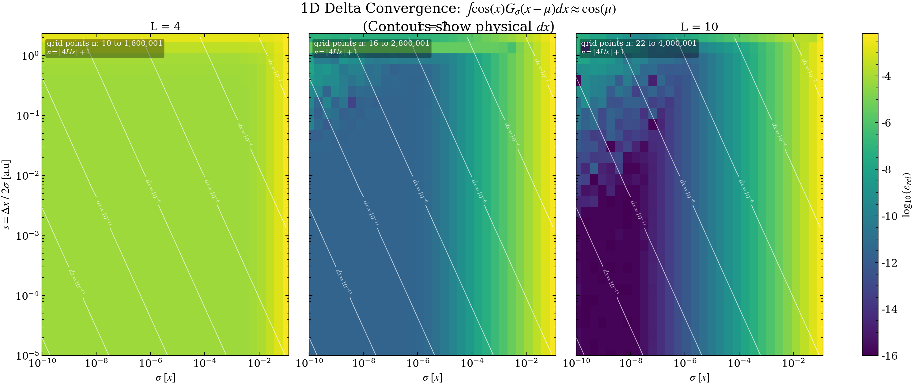

$$
\boxed{\begin{align}
\;&  \int \left\{\int 
f^{T}(\mathcal{E}')\big[1-f^{T}(\mathcal{E})\big]\,
\rho(\mathcal{E}')\, \rho(\mathcal{E})\,
\delta\!\left(\mathcal{E}'-\mathcal{E}-\hbar\omega\right)\,
d\mathcal{E}'\,\right\} d\mathcal{E} \tag{3}\\ \\ 
=\;& \int_{0}^{\infty}
f^{T}(\mathcal{E}+\hbar\omega)\big[1-f^{T}(\mathcal{E})\big]\,
\rho(\mathcal{E}+\hbar\omega)\, \rho(\mathcal{E})\,
d\mathcal{E} \tag{4}\\ 
\end{align}}
$$

Later, in momentum space, we're not going to be able to simply resolve the delta function. We therefore need to establish an approximation to simulate the action of the delta. For the approximation we use a Gaussian function with vanishing variance.

$$
\begin{align}
 \lim\limits_{\sigma\to0}\int &
f^{T}(\mathcal{E}')\big[1-f^{T}(\mathcal{E})\big]\,
\rho(\mathcal{E}')\, \rho(\mathcal{E})\,
\frac{{\exp\left[ -\left( \frac{\mathcal{E}'-\mathcal{E}-\hbar\omega}{\sigma\sqrt{ 2 }} \right)^{2} \right]}}{\sigma \sqrt{ 2\pi }}\,
d\mathcal{E}' \tag{3*}\\ \\ 
& 
f^{T}(\mathcal{E}+\hbar\omega)\big[1-f^{T}(\mathcal{E})\big]\,
\rho(\mathcal{E}+\hbar\omega)\, \rho(\mathcal{E})\,
 \tag{4*}\\ 
\end{align}
$$

- [ ] POC
	- [ ] show convergence requirements for a simple 1D integral $$\int\limits_{}^{} x\delta(x-\mu) \, dx =\mu$$where the $\delta$ is approximated by a Gaussian.
	- [ ] show convergence requirements for a simple 2D integral $$ \int\limits_{-1}^{1} xy \; \delta(x-y-\mu) \, dxdy =\int\limits_{-1}^{1}  (y+\mu)y \;  dy$$ where the $\delta$ is approximated by a Gaussian.
- [ ] once the necessary parameters for convergence are established assert them in comparing between the resolved $(4)$ and unresolved $(3)$ expressions.