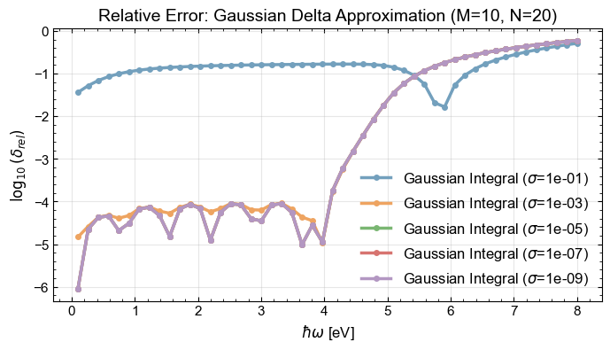

### Gaussian Delta Approximation (Double Integral)
We approximate the energy conservation delta function $\delta(E_1 - E_2 - \hbar\omega)$ with a Gaussian $G_\sigma(x)$ of width $\sigma$. To optimize performance, the integration over the energy difference $u = E_1 - E_2 - \hbar\omega$ is restricted to a window $[-M\sigma, M\sigma]$ with $N$ steps within $2\sigma$:

$$ I(\hbar\omega) \approx \int \rho(\mathcal{E}_1)f(\mathcal{E}_1) \left[ \int_{-M\sigma}^{M\sigma} \rho(\mathcal{E}') [1-f(\mathcal{E}')] G_\sigma(u) \, du 
\right] d\mathcal{E}_1 $$

where $\mathcal{E}' = \mathcal{E}_1 - \hbar\omega - u$. The parameters $M$ and $N$ allow tuning the balance between accuracy and computational cost.

