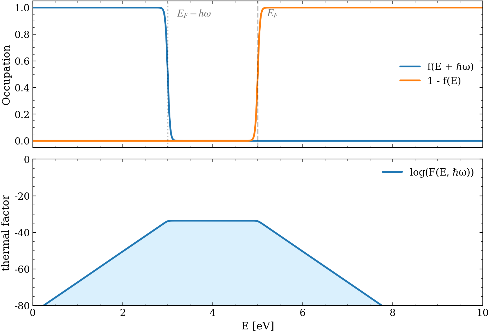

# Intraband transitions
- discuss constant eDOS approximation (which appears to be a very bad approximation)
$$
\boxed{\begin{align}
I_{e}^{T}(\hbar\omega) \propto\;& \iint\limits_{\text{BZ}} 
f^{T}(\mathbf{k}_{1})\big[1-f^{T}(\mathbf{k}_{2})\big]\,
\delta\!\left(\mathcal{E}(\mathbf{k}_{1})-\mathcal{E}(\mathbf{k}_{2})-\hbar\omega\right)\,
d^{3}k_{1}\, d^{3}k_{2} \tag{1}\\ \\
\approx\;& \iint_{0}^{\infty} \,
f^{T}(\mathcal{E}(k_{1}))\big[1-f^{T}(\mathcal{E}(k_{2}))\big]\,
\delta\!\left(\mathcal{E}(k_{1})-\mathcal{E}(k_{2})-\hbar\omega\right)(4\pi k_{1}^{2})(4\pi k_{2}^{2}) \ \,
dk_{1}\, dk_{2} \tag{2}\\ \\ 
=\;& \iint_{0}^{\infty}
f^{T}(\mathcal{E}_{1})\big[1-f^{T}(\mathcal{E}_{2})\big]\,
\rho(\mathcal{E}_{1})\, \rho(\mathcal{E}_{2})\,
\delta\!\left(\mathcal{E}_{1}-\mathcal{E}_{2}-\hbar\omega\right)\,
d\mathcal{E}_{1}\, d\mathcal{E}_{2} \tag{3}\\ \\ 
=\;& \int_{0}^{\infty}
f^{T}(\mathcal{E}+\hbar\omega)\big[1-f^{T}(\mathcal{E})\big]\,
\rho(\mathcal{E}+\hbar\omega)\, \rho(\mathcal{E})\,
d\mathcal{E} \tag{4}\\   \\
\approx\; &\rho^{2}(\mathcal{E}_{F})\int_{0}^{\infty}
f^{T}(\mathcal{E}+\hbar\omega)\big[1-f^{T}(\mathcal{E})\big]\,
\,
d\mathcal{E} \tag{5}\\ \\ 
=\; &\rho^{2}(\mathcal{E}_{F}) \frac{k_BT}{e^{\beta\hbar\omega}-1}\Big[\beta\hbar\omega+\ln\left(1+e^{-\beta\mu}\right)-\ln\left(1+e^{\beta(\hbar\omega-\mu)}\right)\Big] \tag{6}\\ \\
\approx\;& \rho^{2}(\mathcal{E}_{F})\,\frac{\hbar\omega}{e^{\beta\hbar\omega}-1}\, \tag{7}
\end{align}}
$$

[A4 - Thermal Factor Energy Space](../Appendices/A4%20-%20Thermal%20Factor%20Energy%20Space.md)
- [ ] add an explanation appendix (in a new `A2_derivation_of_analytic_expression.md` note in this folder) that details all the steps and assumptions required to reach from $(1)\to(7)$

After we assume that the transition dipole matrix is a constant of $k$, we're left with $(1)$. From there the transition into Yonatan's analytic expression is outlined below

- $(1)\to(2)$ parabolic band **approximation**
- $(2)\to(3)$ $k\to\mathcal{E}$ basis transfer
- $(3)\to(4)$ delta resolution
- $(4)\to(5)$ constant eDOS **approximation**
- $(5)\to(6)$ analytic integration
- $(6)\to(7)$ low emission energy / temperature **approximation**

To assess the regimes of validity of this approximation we proceed from the bottom up

# Phase 1 (Assessing Approximations)
Both for equilibrium an non-equilibrium case

| stage                                                                         | comparison                | purpose                                              |
| ----------------------------------------------------------------------------- | ------------------------- | ---------------------------------------------------- |
| [3.2 - Analytic Approximations](../Sections/3.2%20-%20Analytic%20Approximations.md)             | $$(6)\leftrightarrow(7)$$ | establish validity regime of analytic approx         |
| [3.1 - Numeric Convergence](../Sections/3.1%20-%20Numeric%20Convergence.md)                   | $$(5)\leftrightarrow(6)$$ | establish numeric convergence under constant eDOS approx |
| [3.3 - Constant eDOS Approximation](../Sections/3.3%20-%20Constant%20eDOS%20Approximation.md) | $$(4)\leftrightarrow(5)$$ | establish validity of constant eDOS approx           |

# Phase 2 (Option I - Dealing with Delta Directly)

| stage                                                                                     | comparison                | purpose                                                                                                                                                                  |
| ----------------------------------------------------------------------------------------- | ------------------------- | ------------------------------------------------------------------------------------------------------------------------------------------------------------------------ |
| [3.4 - Delta Approximation](../Sections/3.4%20-%20Delta%20Approximation.md) | $$(4)\leftrightarrow(3)$$ | establish validity of delta approximation by a gaussian in e-space 2D                                                                                                    |
| [5 - Delta (2D) Approximation K-Space](../Sections/5%20-%20Delta%20(2D)%20Approximation%20K-Space.md) | $$(4)\leftrightarrow(2)$$ | establish validity of delta approximation by a gaussian in k-space 2D                                                                                                    |
| [6 - Delta (4D) Approximation K-Space](../Sections/6%20-%20Delta%20(4D)%20Approximation%20K-Space.md) | $$(4)\leftrightarrow(1)$$ | establish validity of delta approximation by a gaussian in k-space 4D (instead of 6D due to symmetry considerations which make it possible to reduce the dimensionality) |
Creating a fine enough grid for a shrinking Gaussian is computationally intensive as it is for 2D integrals. It seems unfeasible as of now for 4D integrals
# Phase 2 (Option II - Change of Variables Approach)

| stage                                                                                               | comparison | purpose                                                                                                        |
| --------------------------------------------------------------------------------------------------- | ---------- | -------------------------------------------------------------------------------------------------------------- |
| [3.5 - Quadratic Band](../Sections/3.5%20-%20Quadratic%20Band.md) |            | Find the energy-space integral for the intraband transition of a non-parabolic band as given by the Rose paper |
| 8 - Parabolic vs Non-parabolic                                                                      |            |                                                                                                                |
| [4 - Interband Transitions](../Sections/4%20-%20Interband%20Transitions.md) |            |                                                                                                                |

- [ ] Since Rosei's band approximations hold only for a fraction of k-space, if we wish to quantify the parabolic vs saddle conduction band contribution, we have to be able to find the integration limits for the parabolic case that integrate of the exact same region in k-space

Under the parabolic band approximation, and due to it's central role in our [main reference material](../../resources/1%20-%20theory-of-hot-photoluminescence-from-drude-metals.pdf), equation $(4)$ serves as our point of reference during all comparisons. Since in equations $(3)$ and $(4)$ the delta function has to be approximated, its validity must be ascertained in both energy and momentum space. Only then can we use it in equation $(1)$ to calculate the non-parabolic (and more accurate) case and, finally, the interband transition.
## Stage 0 — Thermal factor visualization Notation
We use the Fermi–Dirac distribution

$$
f^{T}(\mathcal{E})=\frac{1}{e^{\beta(\mathcal{E}-\mu)}+1},
\qquad
\beta=\frac{1}{k_B T},
$$

with chemical potential $\mu=\mu(\mathcal{E}_F,T)$ and Fermi energy $\mathcal{E}_F$. The density of states $\rho(\mathcal{E})$ is taken to be the free-electron DOS (see `docs/notes/A3 - Electronic Density of States.md`), for which $\rho(\mathcal{E})\propto\sqrt{\mathcal{E}}$.

The thermal factor
$$
f^{T}(\mathcal{E}+\hbar\omega)\,[1-f^{T}(\mathcal{E})]
$$

appears in every stage through Eq. (4)–(7). Before quantifying approximation error, it is useful to visualize its support and characteristic energy scale as a function of $(\mathcal{E}_F,T,\hbar\omega)$.

Figure 0.1: Default visualization of $f(\mathcal{E}+\hbar\omega)[1-f(\mathcal{E})]$ and its factors for a representative $(\mathcal{E}_F,T,\hbar\omega)$ setting.

Discussion:
- The product $f(\mathcal{E}+\hbar\omega)[1-f(\mathcal{E})]$ makes explicit that intraband emission requires both thermally excited electrons above $\mu$ and thermally generated holes below $\mu$. At $T\to 0$ this phase-space vanishes.
- For fixed $\hbar\omega>0$, the product is localized in an energy window of width $\mathcal{O}(k_B T)$ and is maximized when the initial and final energies are approximately symmetric about $\mu$, i.e. when $\mathcal{E}\approx\mu-\hbar\omega/2$.
- This localization justifies later stages that focus numerical effort on resolving a narrow energy region, rather than uniformly resolving the entire $[0,\infty)$ domain.

With this intuition in place, we next quantify the final analytic approximation step, Eq. (7) as an approximation to Eq. (6).
