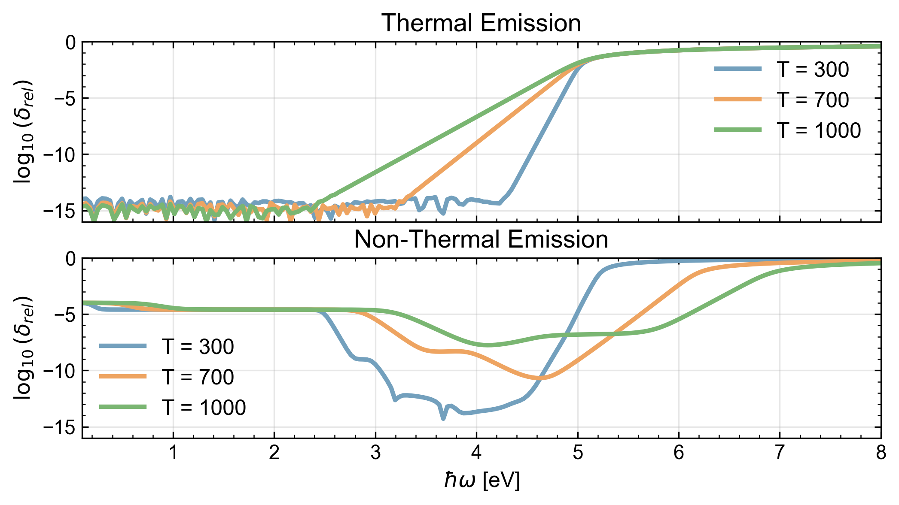

$$
\boxed{\begin{align}
I_{e}^{T}(\hbar\omega)&\approx\;\rho^{2}(\mathcal{E}_{F})\int_{0}^{\infty}
f^{T}(\mathcal{E}+\hbar\omega)\big[1-f^{T}(\mathcal{E})\big]\,d\mathcal{E} \tag{5}  \\
I^{T}(\hbar\omega)\;&\approx \; \rho^{2}(\mathcal{E}_{F})\,\frac{\hbar\omega}{e^{\beta\hbar\omega}-1}\, \tag{7}
\end{align}}
$$

Eq. (6) is a closed-form expression for the constant-eDOS integral, and Eq. (7) is a low energy low temperature approximation. To assess how agreeable the two functions are we calculate their relative error as a function of emission energy $\hbar\omega$ and temperature $T$.

$$
\boxed{\begin{align}
I_{e}^{S}(\hbar\omega)&\approx\;\rho^{2}(\mathcal{E}_{F})\int_{0}^{\infty}
f^{S}(\mathcal{E}+\hbar\omega)\big[1-f^{S}(\mathcal{E})\big]\,d\mathcal{E} \tag{5} \\
I_{e}^{S}(\hbar\omega)&\approx \rho^{2}(\mathcal{E}_{F})\Big[ \mathcal{E}_{BB}(\omega) + \delta_{E} \ A(\omega, \omega_{L}) + \delta^{2}_{E} \ B(\omega, \omega_{L}) \tag{8}
\end{align}}
$$

**figure 3.2.1** Analytic approximation vs constant eDOS numeric comparison. Thermal comparison in the upper graph and non-equilibrium in the lower. Each relative error spectrum is calculated for three different temperatures.

A more enlightening view can be seen in a heatmap (need to add one that draws comparison for non thermal distributions)

**Figure 3.2.1**: Heat map of $\log_{10}|\delta_{\mathrm{rel}}|$ for Eq. (7) relative to Eq. (6), evaluated at $\mathcal{E}_F=5\,\mathrm{eV}$. The vertical axis is plotted in $k_B T$ (with a secondary axis in $T$) to make the controlling dimensionless ratios explicit.

$$
\begin{align}
&\ln\left(1+e^{\beta(\hbar\omega-\mu)}\right)\approx 0 \\
&\iff {\beta(\hbar\omega-\mu)}\ll-M && M\in\mathbb{R}>0 \\
&\iff k_{\small B}T\ll \mu - \frac{1}{M}\hbar\omega
\end{align}
$$

## Results and discussion
If one is concerned with low electron temperatures and emission energies $\hbar\omega < \mathcal{E}_{F}$ the approximation. Still, it is not clear why on

- In the beginning I was calculating $\delta_{\text{rel}}$ with $(7)$ and $(8)$ explicitly. This created an issue for very small values of $\hbar\omega$ due to an unstable factor of ${n_{B}(\omega)/}{n_{B}(\omega)}$. This was immediately solved by simply cancelling the two terms.

In the remainder of the pipeline we will use Eq. (6) as the “exact” constant-eDOS reference. The next stage therefore establishes that the numerical evaluation of Eq. (5) converges to Eq. (6) for a practical (and not overly conservative) choice of integration step $\Delta\mathcal{E}$.
