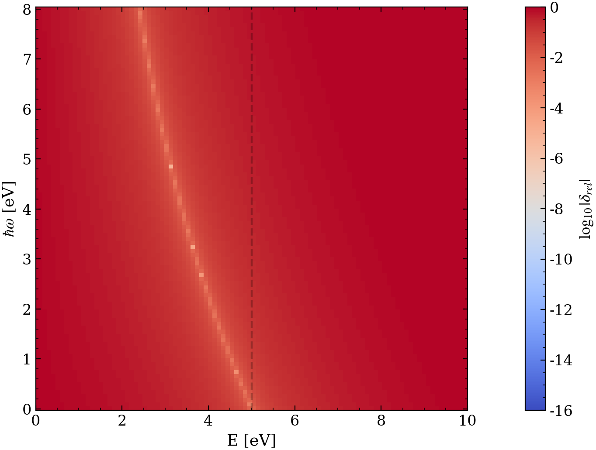
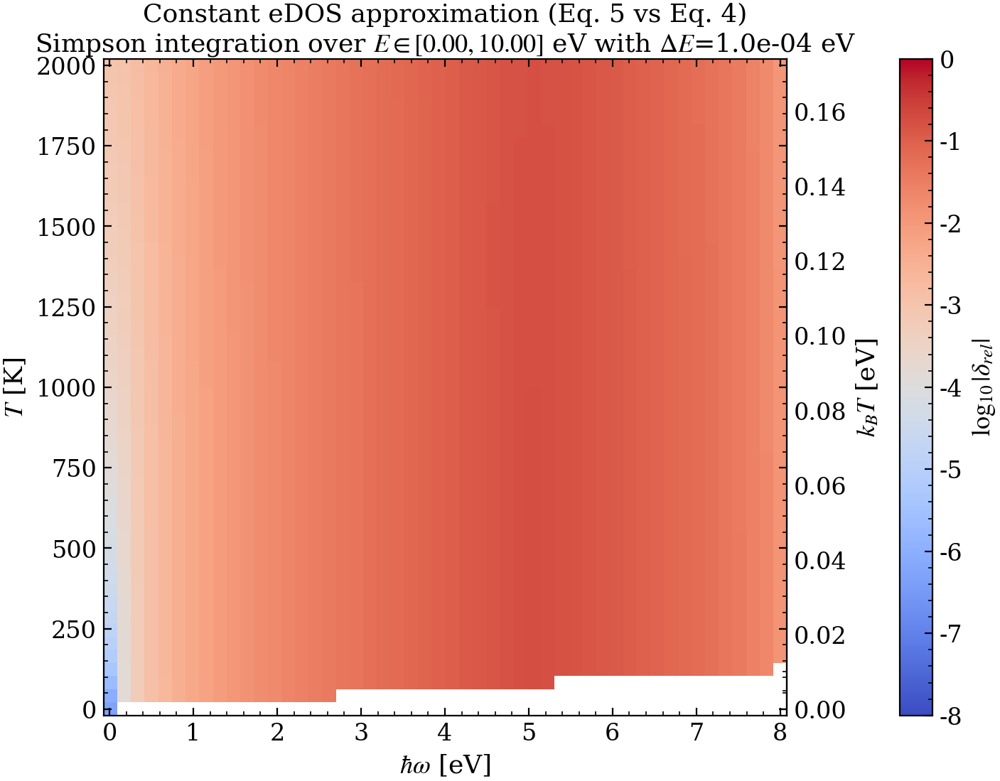

$$
\boxed{\begin{align}
\;& \int_{0}^{\infty} f^{T}(\mathcal{E}+\hbar\omega)\big[1-f^{T}(\mathcal{E})\big]\,
\rho(\mathcal{E}+\hbar\omega)\, \rho(\mathcal{E})\, d\mathcal{E} \tag{4} \\ \\ \; &\int_{0}^{\infty}
f^{T}(\mathcal{E}+\hbar\omega)\big[1-f^{T}(\mathcal{E})\big]\,\rho^{2}(\mathcal{E}_{F}) \;  d\mathcal{E} \tag{5}
\end{align}}
$$

Stage 2 established that Eq. (5) can be evaluated numerically to high accuracy on a practical $\mathcal{E}$ grid. We now address the dominant approximation in the analytic pipeline: the replacement
$$
\rho(\mathcal{E}+\hbar\omega)\rho(\mathcal{E})\;\approx\;\rho^2(\mathcal{E}_F),
$$
which turns Eq. (4) into Eq. (5).

We define the stage-3 relative error as
$$
\delta_{\mathrm{rel}}^{(3)}(\hbar\omega)
=\left|\frac{I_{(5)}(\hbar\omega)-I_{(4)}(\hbar\omega)}{I_{(4)}(\hbar\omega)}\right|,
$$
where $I_{(4)}$ and $I_{(5)}$ denote the $\mathcal{E}$ integrals in Eq. (4) and Eq. (5), evaluated on the same numerical grid.

## Diagnosing the approximation: pointwise DOS-product mismatch

To separate the *DOS* effect from the *thermal* weighting, we also examine the pointwise mismatch
$$
\delta_{\text{DOS}}(\mathcal{E},\hbar\omega)
=\left|\frac{\rho(\mathcal{E}+\hbar\omega)\rho(\mathcal{E})-\rho^{2}(\mathcal{E}_{F})}{\rho(\mathcal{E}+\hbar\omega)\rho(\mathcal{E})}\right|
=\left|1-\frac{\rho^{2}(\mathcal{E}_F)}{\rho(\mathcal{E}+\hbar\omega)\rho(\mathcal{E})}\right|.
$$

For the free-electron DOS $\rho(\mathcal{E})\propto\sqrt{\mathcal{E}}$ this reduces to
$$
\delta_{\text{DOS}}(\mathcal{E},\hbar\omega)
=\left|1-\frac{\mathcal{E}_F}{\sqrt{\mathcal{E}(\mathcal{E}+\hbar\omega)}}\right|,
$$
so the locus of minimal DOS mismatch satisfies
$$
\mathcal{E}(\mathcal{E}+\hbar\omega)=\mathcal{E}_F^2.
$$

## Figure: point-wise DOS mismatch

Figure 3.2: Heat map of $\log_{10}\delta_{\text{DOS}}(\mathcal{E},\hbar\omega)$ for $\rho(\mathcal{E})\rho(\mathcal{E}+\hbar\omega)$ relative to $\rho^2(\mathcal{E}_F)$, evaluated at $\mathcal{E}_F=3\,\mathrm{eV}$.
## Results and discussion
Figure 3.2 shows that the constant-DOS-product assumption is only plausible in regions where the geometric mean $\sqrt{\mathcal{E}(\mathcal{E}+\hbar\omega)}$ remains close to $\mathcal{E}_F$. For fixed $\mathcal{E}_F$, large $\hbar\omega$ forces one of the two energies to be far from the other, and for small $\mathcal{E}$ the free-electron DOS varies rapidly and the mismatch necessarily grows.

The physically relevant quantity, however, is the $\mathcal{E}$-integrated error (Figure 3.1), where $\delta_{\text{DOS}}(\mathcal{E},\hbar\omega)$ is weighted by the thermal factor $f^{T}(\mathcal{E}+\hbar\omega)[1-f^{T}(\mathcal{E})]$. Since this thermal factor localizes the integral to an energy window of width $\mathcal{O}(k_B T)$ (Stage 0), the approximation quality depends on whether that window samples energies for which $\rho(\mathcal{E})$ is approximately constant on the relevant scale.

The trends in Figure 3.1 are consistent with this picture:

- Increasing $T$ broadens the contributing energy range, sampling regions where $\rho(\mathcal{E})$ varies more strongly; this generally increases $\delta_{\mathrm{rel}}^{(3)}$.
- Increasing $\mathcal{E}_F$ (at fixed $T$) reduces the relative variation of $\rho(\mathcal{E})$ over a fixed absolute energy window and improves the approximation.
- The pronounced structure near $\hbar\omega\sim\mu$ reflects the fact that the $T\to 0$ support of the thermal factor expands to an interval of length $\hbar\omega$; as $\hbar\omega$ grows, the integral probes further away from $\mathcal{E}_F$ where $\rho(\mathcal{E})$ is not well approximated by a constant.

Having quantified the constant-eDOS approximation, the remaining stages address the earlier steps in the derivation—most notably the delta-function resolution that connects Eq. (3) to Eq. (4).
